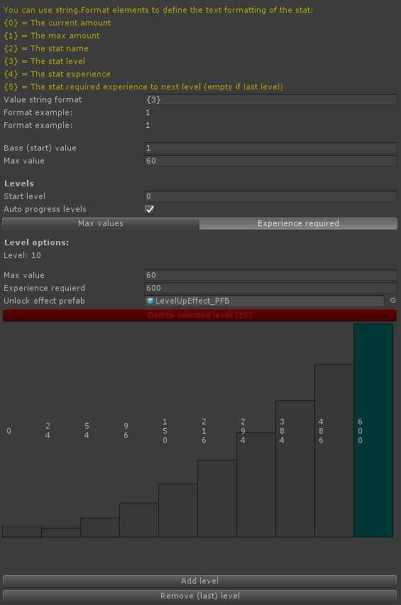

# Stat Levels

Stat levels can be used to increase the stat's max value when a certain level is reached. This can be useful for various different stats such as the player's level, upgreadable health, woodcutting levels and much more.

To set up the levels of a stat you can set these values in the main stat editor. To define a level you need to set it's required experience to reach said level, and optionally the new maximum value that comes with the level.

**For example (Health):**
Level 1: 100 Health
Level 2: 200 Health

When the Health stat reaches level 2 the player can have up to 200 health.



To increase a stat's level you can use the simple API to add experience or directly set the level to a specified level.

```


        void SetLevel(int index, bool setMaxValueToLevelMaxValue, bool fireEvents = true);
        void IncreaseLevel(bool setMaxValueToLevelMaxValue, bool fireEvents = true);
        void DecreaseLevel(bool setMaxValueToLevelMaxValue, bool fireEvents = true);
        void ChangeExperience(float experience, bool fireEvents = true);
        void SetExperience(float experience, bool fireEvents = true);


```

For example:

```


void Start()
{
    var healthStat = PlayerManager.instance.currentPlayer.inventoryPlayer.stats.Get("Default", "Health");
    healthStat.ChangeExperience(10f); // Add 10 experience to the health stat.
}


```

#### Events

Optionally you can also listen for events when a stat changes its level, or when the experience changes. This can be useful to show a visual, or to repaint some UI elements.

```


void Start()
{
    var healthStat = PlayerManager.instance.currentPlayer.inventoryPlayer.stats.Get("Default", "Health");
    healthStat.OnExperienceChanged += OnExperienceChanged;
    healthStat.OnLevelChanged += OnLevelChanged;
}

void OnExperienceChanged(IStat stat)
{
    // Callback when health experience changes.
}

void OnLevelChanged(IStat stat)
{
    // Callback when health level changes.
}

```