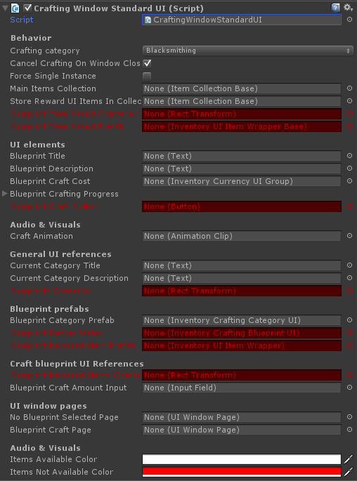

# Crafting

## Window

The crafting window requires quite a bit of configuration, as you can see below, to allow for various use cases a lot of options are implemented, we can just use what we need, and leave the rest blank. Fields marked red, are of course required.

| Main items collection | The collection is used to search for items. When left empty all of the current player's inventories will be used. |
| --- | --- |
| Store reward UI items in collection | The collection used to store all reward items. When left blank the items will go directly to the current player's inventories. |
| Blueprint item result container | The container used to visualize the craft reward (wrappers are instantiated into this container, which display the reward items). |
| Blueprint item result prefab | The wrapper (has to be a prefab) used to display the reward items |
| Blueprint craft button | The button used to start the crafting progress |
| Blueprints container | The container used to visualize the blueprints in (Blueprint button prefab objects are instantiated into this container). |
| Blueprint button prefab | The blueprint (has to be a prefab) that shows a single blueprint. |
| Blueprint required item prefab | The wrapper (has to be a prefab) used to display a required item. |
| Blueprint required items container | The container used to visualize the required craft items (wrappers are instantiated into this container, which display the required items). |

## Triggers

| Crafting items collection | The collection used to search for items that can be used to craft the item. |
| --- | --- |
| Crafting reward items collection | The collection in which the reward items of the craft will be stored. |
| Progress share setting | The share setting allows you to share progress between triggers or seperate the progress completely. For example if you were to have 2 campfires the share setting would have the following effect:Default: Progress is per instance, each campfire maintains it's own progress.Force single instance per category: Only 1 craft can be active per categoryForce single instance: Only 1 craft can be active at a time. |

