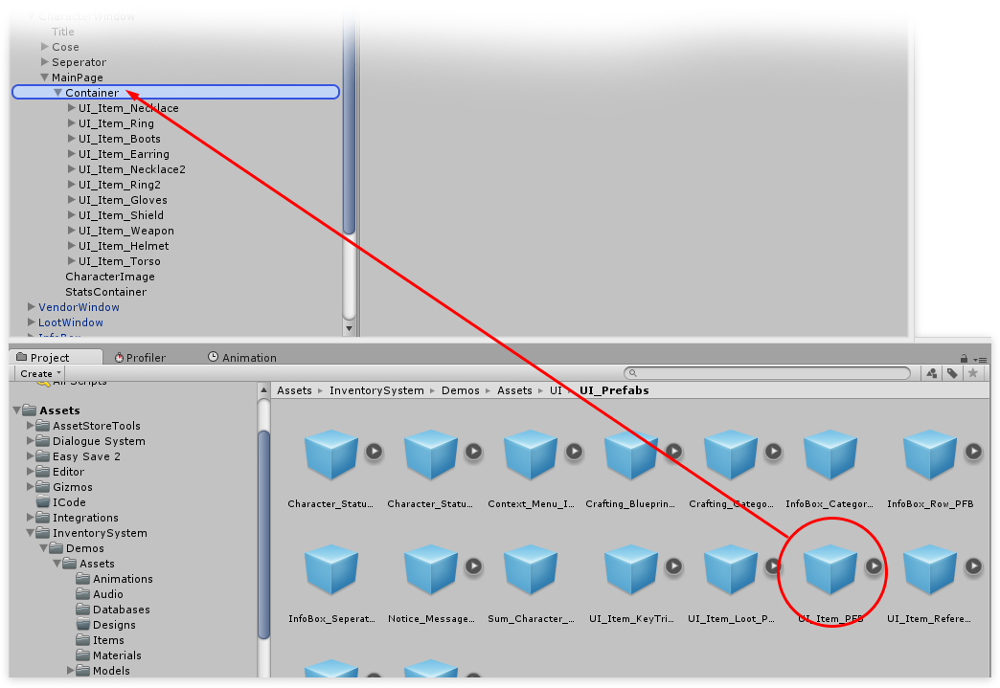
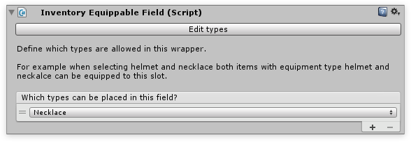
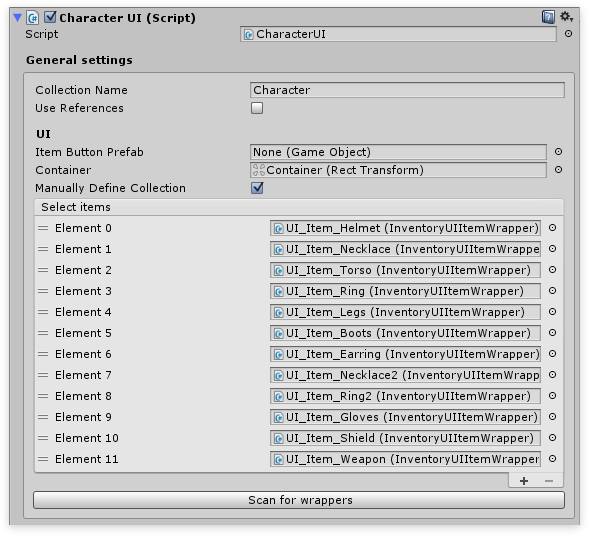

# plyGame getting started

## Step 1

Attatch the  **plyInventoryPlayer** component to your plyGame character. Make sure it’s attached to the transform that defines the player’s position ( usually on the same transform as the CharacterController component ).

## Step 2

Assuming you’ve already created some Equipment types inside the equip editor. we can continue. If not have a look at the  [equip editor documentation](http://devdog.nl/documentation/equipment-editor/). First create a new object inside the Canvas and name it “CharacterWindow”. Next add the plyCharacterUI component to this object. All plyGame specific scripts can be found in the Add component menu under  **InventorySystem/Integrations/plyGame/***

-   **Manually define collection:**  Because we know how many equip slots there will be, and want to manually define the layout we can define the collection by ourselves.
-   **Only allow items of type:**  allows us to limit this collection to a certain time, equippable items in this case, after all equipping a consumable strawberry would be rather odd… even by my standards.
-   **Can drop from collection:**  Note that at the bottom, I disabled Can drop from collection, as this likely wouldn’t be desired behavior, as well as Can stack items in collection, as we don’t want our equipment to stack (UFPS users might want to enable it for ammo).

## Step 3

When we enable “Manually define collection”, we’ll have to – you’ve guessed it – manually select the items that we wish to use inside our collection. You can do this by grabbing the UI_Item_PFB object inside the demo folder and drag it inside your Container object in the hierarchy.

Once you’ve defined your layout using the UI item wrappers, select all of them and add the  **InventoryEquippableField** component, which you can find under  **/InventorySystem/UI Helpers/Equippable field.** The InventoryEquippableField defines a location where a given equip type (as defined in the equip editor) can be equipped.

You can mix and match equip types on your equippable fields as much as you like, for example if you wish to allow the player to equip an item 2, 3 or 4 times – let’s say a dagger for example – you can simply add the “Dagger” type to a 2nd equippable field.

## Step 4

Once all wrappers are set up in the CharacterUI they need to be referenced. You can do this by going to your CharacterUI and hitting the Scan for wrappers button at the bottom.

