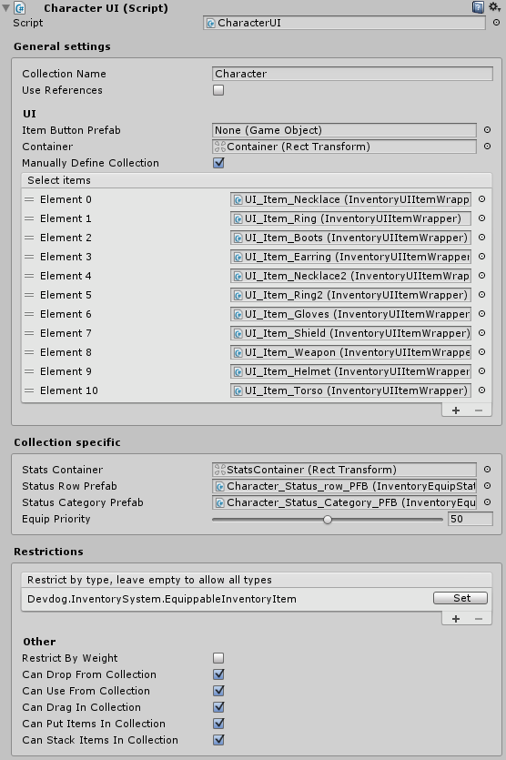
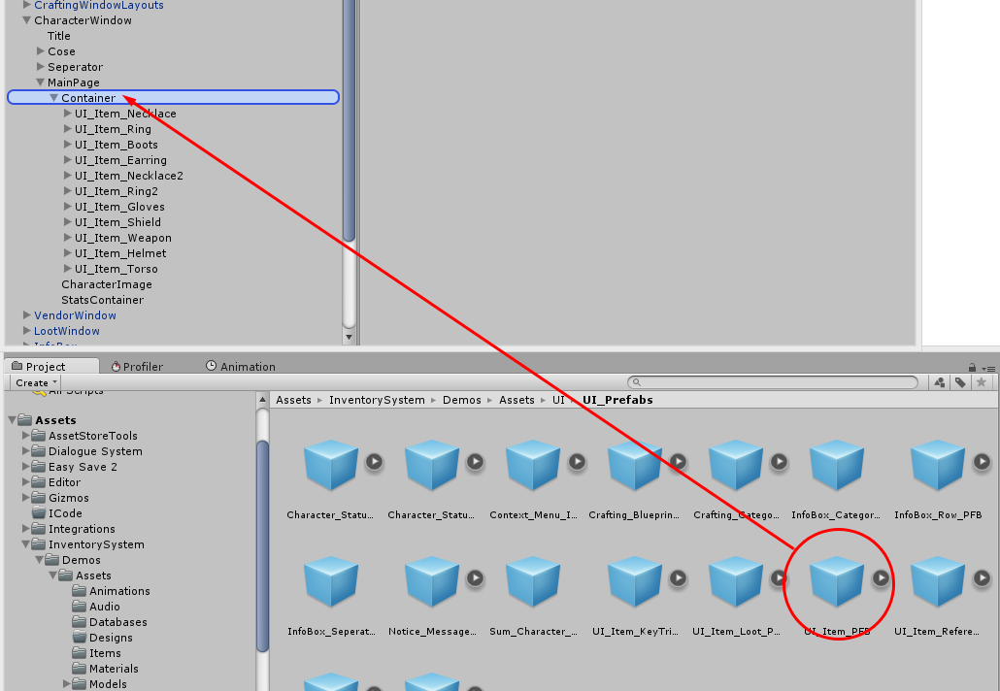
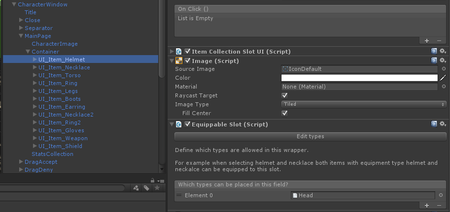

# Character collection

First create a new object inside the Canvas and name it “CharacterWindow”. Next add the CharacterUI component to this object (`Inventory Pro/Windows/Character`).

Because we know how many equip slots there will be, and want to manually define the layout we can define the collection by ourselves. Only allow items of type allows us to limit this collection to a certain time, equippable items in this case, after all equipping a consumable strawberry would be rather odd… even by my standards.

Note that at the bottom, I disabled Can drop from collection, as this likely wouldn’t be desired behavior, as well as Can stack items in collection, as we don’t want our equipment to stack (UFPS users might want to enable it for ammo).

When we enable “Manually define collection”, we’ll have to – you’ve guessed it – manually select the items that we wish to use inside our collection. You can do this by grabbing the UI_Item_PFB object inside the demo folder and drag it inside your Container object in the hierarchy.

Once you’ve defined your layout using the UI item wrappers, select all of them and add the “EquippableField” component, which you can find under `/Inventory Pro/UI Helpers/Equippable slot`

The Equippable Slot defines a location where a given equip type can be equipped. If you select an item inside your container and look at the Equippable Slot component you’ll notice that you can select the previously defined types (inside the equipment editor).

Simply select the item types that are allowed to be stored in the selected slot. For example, for the UI_Item_Helmet object I’ve created an Head equip type inside the editor first, and then assigned it inside the inspector’s Equippable Slot.

You can mix and match equip types on your equippable slots as much as you like, for example if you wish to allow the player to equip an item 2, 3 or 4 times – let’s say a dagger for example – you can simply create a 2nd UI_Item_* object, or add the “Dagger” type to a 2nd equippable field.