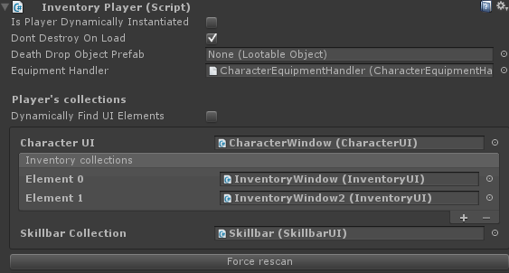

# Player

Select your player and add the InventoryPlayer component to it. Once added you'll have to assign the character window that belongs to that player (leave empty when not using a character window), the inventories that belong to this player, and the player's skillbar.

Once the character window is assigned you can hit the "Force re-scan" button; This will load the CharacterUI's equipment fields and allow you to bind them to a player's bone.

For example, you have the equippable field "Head" in your CharacterUI, once you've hit the Force re-scan the "Head" field will appear in the equipment binding list. Here you can then associate a bone with this equipment location.

**Is Player Dynamically Instantiated:** If you manually instantiate the player check this box. When the player is instantiated call InventoryPlayer.Init() to finalize the player. This will make the player's collections active and items can be picked up from then on. When using the InventoryPlayerSpawner you do have to check Is Player Dynamically Instantiated, but Init() will be called automatically for you.

**Dont Destroy On Load:** When switching scenes, should the player object be persistent or not? When checked the object will not be destroyed and be carried over to the next scene.

**Death Drop Object Prefab:** When the player dies what object should it drop?

**Equipment Handler:** The equipment handler is the code that can equip items to your character. Optionally you can integrate your own to gain more control over equipment. By default you can use the CharacterEquipmentHandler type, which is already present in the project.

**Dynamically Find Elements:** When your player is dynamically instantiated it can no longer have references to scene objects. This is a restriction of Unity. To work around this you can check Dynamically Find Elements, which, instead of a reference to a component uses a string to find it by name when your player becomes active. You'll likely want to combine this with Is Player Dynamically Instantiated.

## Player2D

Building a 2D game? In this case you have to change the Player component for a Player2D component. All components suffixed with "2D" are for 2D use only, while some components with no suffix can be used in either 2D or in 3D (for example, the Trigger).

Triggers respond to the player coming in range. When using a 2D player object the triggers have to have a 2D trigger or collider component to be detected.